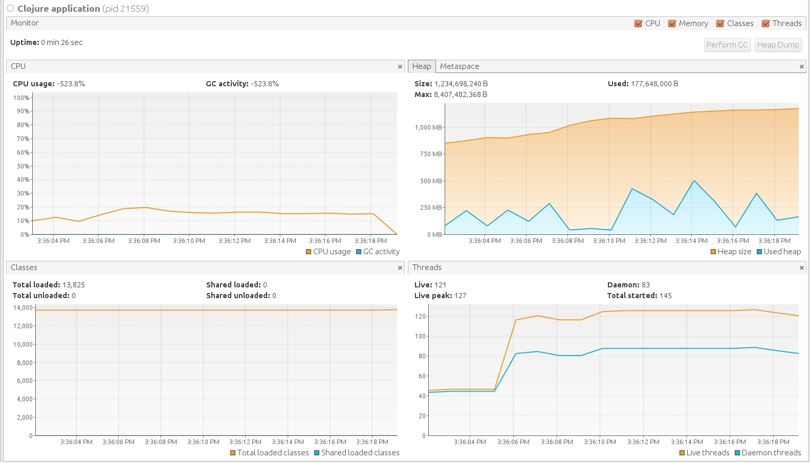

# simple-fasttext-server

You send an http `get` with some text, and get label probabilities for it.

## Installation

1. install [leiningen](https://leiningen.org/) if not already installed
2. clone this repo
3. change directory to the included directory `fasttext`.
4. place your trained fasttext model here ― it should be named `classifier.bin`.
5. git clone https://github.com/facebookresearch/fastText.
6. validate the installation by running `lein test`

## Usage

to start the server:

```
lein run [port]
```

to get a response, make an http `get` request with the single query parameter `text`. E.g. with curl this would look like ―
```
curl -G http://localhost:3001/predict --data-urlencode "text=classify me"
```

## Performance notes
Currently utilizes just one fasttext worker! support for multiple workers is not built-in yet. See below the VisaulVM output of the performance and throughput tests (included in the `test` directory) as of the current commit on a 12-core i7 ―

 
